# CV Sport Geometry

**CV Sport Geometry** is a computer vision project that detects key points and geometric structures of **tennis courts** using **NumPy**, **classical computer vision algorithms and techniques**, and **mathematical concepts** such as **linear algebra** - no neural network applied.

The goal of this project is to accurately identify and extract the main lines, intersections, and reference points on a tennis court from images. Details and assumptions in the next chapter.

> ⚠️ **NOTE:** This solution is **not intended for production use**.  
> It is an experimental project aimed at evaluating how classical image processing techniques perform in detecting key points of a tennis court.


Key libraries used:
- numpy
- opencv-python
- matplotlib
- pydantic
- scikit-image
- label-studio

Key computer vision concepts included:
- color space analysis
- binarization and thresholding
- Canny Edge Detection
- the Probabilistic Hough Transform (PHT)
- morphological operations
- skeletonization
- contour detection
- perspective transformation


## Getting Started

Follow the steps below to set up and run the project locally.


### 1. Clone the Repository

Make sure you have **git** installed.  
Then clone the repository and navigate to the project directory:

```bash
git clone https://github.com/username/cv-sport-geometry.git
cd cv-sport-geometry
```

### 2. Requirements
You need to have <a href="https://docs.astral.sh/uv/getting-started/installation/">uv installed</a> on your system to manage the virtual environment and dependencies.
Once it’s installed, you can proceed with the setup.

### 3. Create and Activate the Virtual Environment
```bash
uv venv
source .venv/bin/activate  # Linux / macOS

.venv\Scripts\activate     # Windows
```

### 4. Sync Dependencies
Install all required dependencies using:
```bash
uv sync
```
This will install all packages defined in **pyproject.toml**.

### 5. Run the Project
Depending on how your entry point is defined, you can run the main script with:

```bash
uv run python main.py
```

## Project structure

## Project Assumptions

The project makes the following assumptions about the input images:

- The image must depict a **tennis court** where the **entire half of the court facing the camera** is clearly visible.  
- The **net** must be **visible** and **black in color**.  
- The photo should be taken **at a slight angle** relative to the court’s main axis, **not directly from the front**.

Below are examples of tennis courts that **meet** and **do not meet** the project assumptions. In the non-compliant image, the far corner of the baseline is not visible.

| **compliant** | **non-compliant** |
|----------------|------------------|
|  |  |

## Objective

The goal is to develop an algorithm using **classical computer vision techniques** that detects **12 key points** on a tennis court and connects them with **straight line segments** to delineate the **playing field** and its **sub-areas**.  
Each point has been assigned a **unique, unambiguous identifier** to avoid any ambiguity during detection and post-processing.

The images below provide a complete description of all target elements.


Key points with their names and explanations:
  1. `closer_outer_baseline_point` - the point closest to the camera, located at the intersection of the baseline and the outer doubles sideline.
It should be the lowest point on the court in the image
  2. `closer_outer_netline_point` - the intersection point of the tennis court’s nearer doubles sideline with the net
  3. `further_outer_baseline_point` - the opposite point to `closer_outer_baseline_point`, the intersection of the court’s far doubles sideline with the baseline
  4. `further_outer_netline_point` - the point opposite to `closer_outer_netline_point` - the intersection of the court’s far doubles sideline with the net line
  5. `closer_inner_baseline_point` - the intersection point of the court’s nearer singles sideline with the baseline
  6. `further_inner_baseline_point`- the intersection point of the court’s far singles sideline with the baseline
  7. `closer_inner_netline_point` - the intersection point of the court’s nearer singles sideline with the net line
  8. `further_inner_netline_point` - the intersection point of the court’s far singles sideline with the net line
  9. `net_service_point` - the intersection of the center service line with the net line
  10. `centre_service_point` - the intersection of the service line (parallel to the net) with the center service line
  11. `further_service_point` - the intersection of the court’s far singles sideline with the service line
  12. `closer_service_point` - the intersection of the court’s nearer singles sideline with the service line


By connecting the corresponding points, we obtain the following lines that define the playing field and its main areas:
  - `closer_outer_sideline` - the court’s nearer doubles sideline, it connects `closer_outer_baseline_point` with `closer_outer_netline_point`
  - `baseline` - connects `closer_outer_baseline_point` with `further_outer_baseline_point`
  - `netline` - the line representing the court’s net, it connects `closer_outer_netline_point` with `further_outer_netline_point`
  - `further_outer_sideline` - the court’s far doubles sideline, it connects `further_outer_baseline_point` with `further_outer_netline_point`
  - `closer_inner_sideline` - the court’s nearer singles sideline, it connects `closer_inner_baseline_point` with `closer_inner_netline_point` 
  - `further_inner_sideline` - the court’s far singles sideline, it connects `further_inner_baseline_point` with `further_inner_netline_point`
  - `centre_service_line` - the line representing the court’s center service line, it connects `centre_service_point` with `net_service_point` 
  - `service_line` - the line representing the court’s service line (parallel to the net), it connects `closer_service_point` with `further_service_point`


## Algorithm Overview

### Input Parameters

Before the image can be processed, the algorithm requires a set of predefined **input parameters** that control various thresholding and detection stages.  These parameters directly influence the sensitivity of edge detection, line merging, and intersection finding.

Example configuration:
```json
{
  "bin_thresh": 0.7,
  "bin_thresh_endline_scan": {"baseline": 0.75, "netline": 0.8},
  "bin_thresh_centre_service_line": 0.7,
  "max_line_gap": 10,
  "max_line_gap_centre_service_line": 100,
  "hough_thresh": 20,
  "min_line_len_ratio": 0.2,
  "offset": 20,
  "extra_offset": 15,
  "surface_type": "another",
  "canny_thresh": {"lower": 20, "upper": 100}
}
```

| **Parameter**                                      | **Description**                                                                           |
| -------------------------------------------------- | ----------------------------------------------------------------------------------------- |
| `bin_thresh`                                       | Base binarization threshold for general court line detection.                             |
| `bin_thresh_endline_scan`                          | Thresholds for scanning along the baseline and netline.                                   |
| `bin_thresh_centre_service_line`                   | Threshold used during central service line extraction.                                    |
| `max_line_gap`, `max_line_gap_centre_service_line` | Maximum gap allowed between merged line segments.                                         |
| `hough_thresh`                                     | Minimum number of votes in Hough Transform for a line to be considered valid.             |
| `min_line_len_ratio`                               | Relative minimal length of accepted line segments.                                        |
| `offset`, `extra_offset`                           | Pixel-based shifts applied during region scanning to stabilize local detections.          |
| `surface_type`                                     | Defines court surface type (`clay`, `hard`, `grass`, etc.), adjusting detection strategy. |
| `canny_thresh`                                     | Lower and upper thresholds for Canny edge detection.                                      |


### 1. Preliminary Image Processing

The purpose of the preprocessing stage is to **load the image and detect the line segments** that will later be merged into full **court lines**. The lines will then be used to compute their **intersection points**, which represent **potential key locations** on the tennis court.

#### 1.1 Image Loading and Line Segment Detection

At this stage, images are **loaded from the input directory**.

The main preprocessing logic focuses on detecting **straight line segments** on the court image. These segments form the geometric basis for later steps, where full lines and their intersection points (potential key points) will be determined.

The following steps are applied:
1. **Convert to grayscale** – simplifies the image to intensity values.  
2. **Apply Gaussian blur** – removes small noise and smooths edges.  
3. **Run Canny edge detection** – produces a binary edge map highlighting white court lines.  
4. **Apply Probabilistic Hough Transform (`cv2.HoughLinesP`)** – detects line segments as pairs of endpoints `[x1, y1, x2, y2]`.  
   - `threshold` – minimum number of votes for a valid line,  
   - `minLineLength` – minimum accepted segment length,  
   - `maxLineGap` – maximum gap between merged segments.

Result:<br>
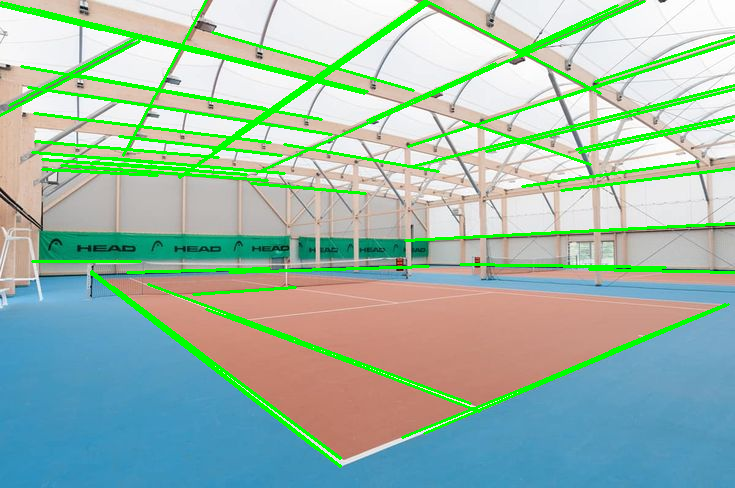

#### 1.2 Computing Line Equation

Next, from the previously detected **line segments**, we construct their corresponding **line equations** in the form:

$$
y = \text{slope} \times x + \text{intercept}
$$

For each segment defined by two endpoints $(x_1, y_1)$ and $(x_2, y_2)$, the slope and intercept are calculated as:

$$
\text{slope} = \frac{y_2 - y_1}{x_2 - x_1}, \qquad \text{intercept} = y_1 - \text{slope} \times x_1
$$

A special case occurs when the line is **vertical** ($x_2 = x_1$), where the slope would be undefined.  
Such lines are handled separately by representing them as:

$$
x = \text{constant}
$$

This distinction is crucial for further geometric computations, such as detecting intersections between horizontal, vertical, and diagonal lines on the court.

Result:<br>
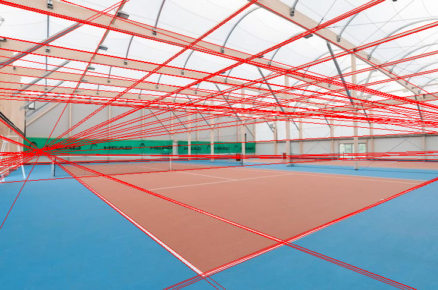


#### 1.3 Line Grouping and Approximation

After computing individual line equations, similar lines are **grouped and approximated** to reduce redundancy and noise.  
Lines that share a **similar orientation (angle)** and **position (intercept or x-value)** are considered part of the same group.

Within each group, an **approximated representative line** is created:
- For **non-vertical lines**, the approximation is based on the **median slope** and **median intercept**.  
- For **vertical lines**, the **median x-coordinate** is used instead.

This process effectively merges overlapping or nearly parallel segments into a smaller, cleaner set of lines that accurately represent the main court boundaries.

Result:<br>
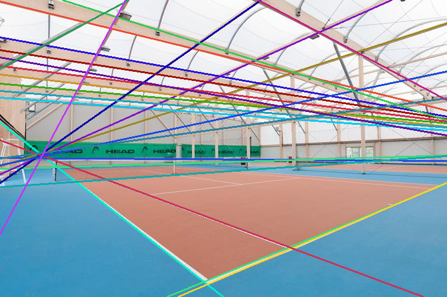


#### 1.4 Line Intersection Point Creation

Once the main court lines are approximated, the next step is to **compute intersection points** between all pairs of grouped lines.  
Each pair of lines is checked to determine whether they intersect within the bounds of the image — if so, the intersection is recorded as a new point.

The intersection logic accounts for both **regular** and **vertical** lines:

- If two lines have the **same slope** or are **both vertical**, no intersection exists.  
- If one line is **vertical** (`x = constant`), the intersection coordinates are computed directly from this `x` value and the other line’s equation $y = \text{slope} \cdot x + \text{intercept}$.  
- If both lines are **non-vertical**, their intersection point is computed analytically as:

$$
x = \frac{b_2 - b_1}{a_1 - a_2}, \qquad y = a_1 \cdot x + b_1
$$

where $a$ and $b$ are the slopes and intercepts of the respective lines.

After computing the point, its coordinates are validated to ensure it lies **within the image boundaries**.  
Only valid intersections are kept — these represent **candidate key points** where real court lines cross on the image.
Result:<br>
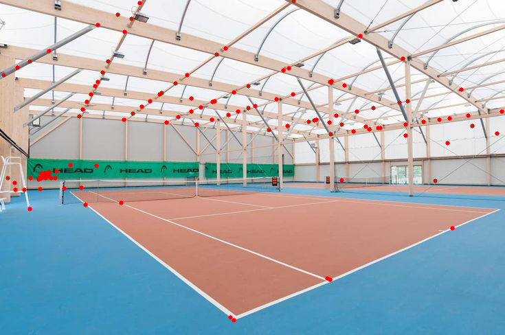


Each valid intersection is represented as an **`Intersection` object**, which stores:
- the **(x, y)** coordinates of the intersection point, and  
- references to the **two lines** that intersect at that point

An example of a single intersection found below:<br>
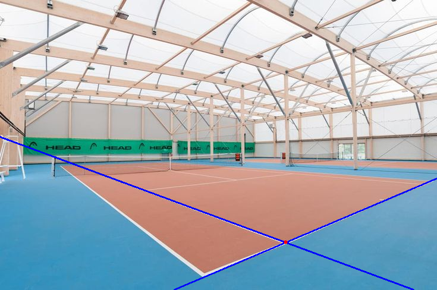

### 2. Finding both `closer_outer_baseline_point`, `closer_outer_netline_point` and `closer_outer_sideline `

At initialization, all detected intersections are **deduplicated and sorted** in descending order of their vertical position (`y` coordinate):  
points closer to the bottom of the image (i.e., closer to the camera) come first.  
This ordered list is stored in **`self.intersections`** and serves as the starting dataset for locating specific court features.

The algorithm first iterates through all detected intersections and filters those located on the **outer baseline side** of the court (angles between 90° and 270°).  
For each candidate intersection:
- It checks both connected lines and searches along them for the **nearest valid intersection** with a similar orientation.  
- The local image region around the point is analyzed to verify whether it forms a **true court corner**.  
- If confirmed, the algorithm proceeds along the same line toward the **net**, using a stepwise traversal.

During this traversal:
- The scan moves upward along the line, skipping the first few steps to avoid local noise.  
- At each step, a thin image stripe is analyzed for **net-line candidates**.  
- When a valid net segment is found, the algorithm computes the **intersection** between the scanning line and the detected net line.  
- The first valid intersection (with opposite line slopes) is selected and transformed back to global image coordinates.

Finally, the following objects should be found:
- the **outer-baseline intersection** (closest corner to the camera),  
- the corresponding **net intersection** found along the same sideline,  
- and the **line** used to connect them.  
If no valid pair is found, the method returns nothing and further proceeding is not possible.

Step 2 results below:<br>
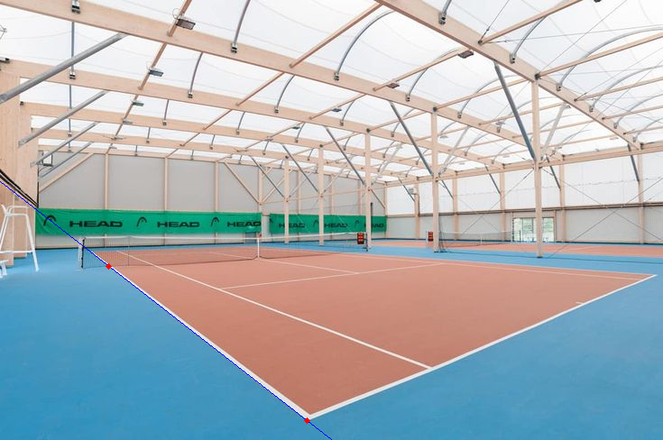

### 3. Finding `further_outer_baseline_point` and `baseline`

Starting from the previously detected **closer outer baseline intersection**,  
the algorithm continues scanning **along the same sideline** but in the direction away from the camera  
to locate the **further outer baseline** (the opposite baseline).

- It switches to the **unused line** connected with the starting intersection  
  (the one not used in the previous step).
- The algorithm then **traverses step by step** along this line, moving upward on the image.
- For each step, it extracts a **local image region** and applies **Canny edge detection**
  followed by **Hough transform** to detect potential line segments.
- These segments are analyzed in `get_further_outer_baseline_corner`,  
  which looks for a **valid outer baseline corner** — an intersection of two lines
  forming an acute angle with opposite slopes.
- Once a valid intersection is found, it is **transformed back to global coordinates**
  and returned together with the corresponding local line.

In short: this step extends the search beyond the near baseline  
to detect the **far-side baseline** using edge and line detection along the same direction.

Step 3 results below:<br>


### 4. Finding `netline`

The algorithm determines the **net line** that divides the two halves of the court.

Starting from the **closer outer net intersection** (previously found), it:
- Moves vertically upward through the image along the expected direction of the **net**.  
- At each step, it analyzes a narrow horizontal image region to detect **linear edge patterns** that match the net’s visual characteristics (thin, dark, nearly horizontal).  
- Detected candidates are refined using **edge detection and Hough transform**,  
  grouping short horizontal segments into a consistent, continuous **net line**.  
- Once a valid net pattern is confirmed, it computes the corresponding **Line object**, representing the global net line in the image space.

In summary: this step uses the previously located reference point to **trace and define the full net line**,  
which serves as a crucial axis for separating and aligning all further geometric computations on the court.

Step 4 results below:<br>


### 5. Finding `further_outer_sideline` and `further_outer_netline_point`

The algorithm detects the **further outer sideline** — the far doubles boundary on the opposite side of the court.

Starting from the **further outer baseline intersection** and referencing the `netline`, it:
- Searches the **upper region** of the image for visual structures aligned with the expected sideline direction.  
- Extracts **contours** from the image to identify elongated, nearly vertical shapes corresponding to potential court boundaries.  
- Depending on the **court surface type**, the detection strategy changes:
  - For **clay courts**, where lines are darker and often partially obscured by surface dust,  
    the algorithm relies more on **contour geometry** and positional consistency.  
  - For **hard and grass courts**, it emphasizes **edge-based detection** using Canny and Hough transformations.  
- Among all candidates, it selects the contour or line that is **most parallel** to the closer outer sideline and forms a valid intersection with the **net line** near the top of the image.

At this stage, the algorithm also determines the `further_outer_netline_point`,  
defined as the **intersection between the detected net line and the further outer sideline**.  
This point completes the outer boundary definition of the tennis court.

Step 5 results below:<br>


### 6. Scanning both endlines to find inner points 

Goal: find the **inner pair** of intersections on the selected endline — i.e.,  
- for **baseline** scan → `closer_inner_baseline_point`, `further_inner_baseline_point`,  
- for **netline** scan → `closer_inner_netline_point`, `further_inner_netline_point`

How it works (common logic):
- **Choose context**: run in **`base`** or **`net`** mode. Each mode sets the **start point**, the **endline** to scan along, and the **far outer reference point** (for dedup tolerance).
- **Traverse along the endline** (window by window), with an initial **warm-up** to skip unstable steps.
- In each window:
  - Convert to **grayscale**, build a **binary mask** using a local threshold `bin_thresh · max(gray)`.
  - **Detect lines with slope opposite** to the scanned endline (Canny → Hough), then **group** them.
  - For each grouped candidate (`min`/`max` representative), compute:
    - its **intersection with the netline** and keep only those lying **between the outer net points** (x-range gate),
    - its **intersection with the scanned endline**, discarding near-duplicates within a **tolerance** around the far-outer endline point.
  - Record valid pairs into **`endline_points_min`** and **`endline_points_max`**.
- **Finalize**: the **first `min`** and the **last `max`** endline intersections define the **closer** and **further** inner points, respectively.

net vs. base specifics:
- **`searching_line="base"`**: start from `closer_outer_baseline_point`; dedupe vs. `further_outer_baseline_point`. Output: inner **baseline** endpoints.
- **`searching_line="net"`**: start from `closer_outer_netline_point`; dedupe vs. `further_outer_netline_point`. Additionally, the local **net segment** is drawn into the binary mask to stabilize detections. Output: inner **netline** endpoints.

After both scans are complete, connecting the corresponding **inner baseline** and **inner netline** points yields:
- the **`closer_inner_sideline`** — between `closer_inner_baseline_point` and `closer_inner_netline_point`,  
- and the **`further_inner_sideline`** — between `further_inner_baseline_point` and `further_inner_netline_point`.

These lines represent the **inner singles boundaries** of the tennis court.

Step 6 results below:<br>


### 7. Detecting the `net_service_point` and `centre_service_line`

This step focuses on detecting the **central vertical axis** of the service area —  
the line that divides the two service boxes and intersects the net.

The algorithm:
- Starts from the **midpoint between the inner sidelines**, which defines the approximate search zone for the court’s **centre line**.  
- Extracts a **narrow vertical region** around this area and applies **edge detection** (Canny) followed by the **Probabilistic Hough Transform** to find thin, nearly vertical line segments.  
- Groups detected segments and selects the most stable one — the **centre service line**.  
- Computes its **intersection with the net line**, defining the `net_service_point` (the midpoint on the net where both service boxes meet).  
- Validates the detection based on geometric symmetry: the identified centre line must lie roughly halfway between the two inner sidelines.

The resulting outputs are:
- the `centre_service_line` (vertical divider of the service area),  
- and the `net_service_point` (its crossing with the net line).

Step 7 results below:<br>
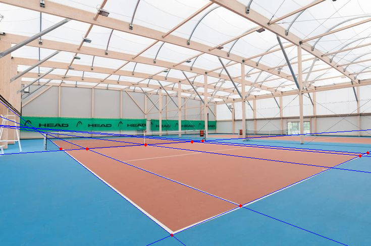


### 8. Detecting the Court Centre Point

The final step identifies the **central reference point** of the court — the geometric centre where the **centre service line** intersects the **service line**.

The algorithm:
- Uses the previously detected **centre service line** and **service line** as inputs.  
- Computes their **intersection point**, which defines the **`centre_service_point`** — the midpoint of the entire playing field.  
- This point serves as a **key geometric anchor**, ensuring correct alignment and proportional scaling of all other detected structures.  
- If either of the lines is missing or unreliable, the method estimates the centre position based on the **average x-coordinate** between both inner sidelines and the **midpoint** between the service boxes.

The result — `centre_service_point` — represents the exact centre of the court, completing the detection of all 12 reference points used to reconstruct the full tennis court geometry.

Step 8 results below:<br>


## Error Measurement – Solution Evaluation

To assess the accuracy and reliability of the algorithm, a dedicated **evaluation procedure** was conducted.

The algorithm was developed and tested based on **6 reference images** of tennis courts. 

|  | 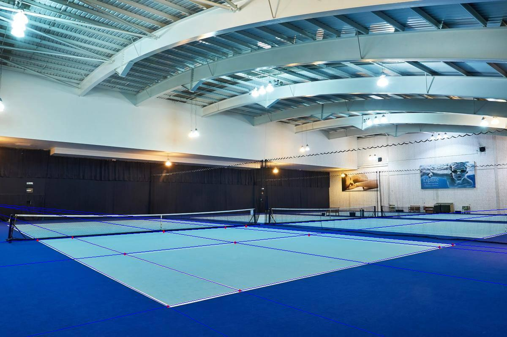 | 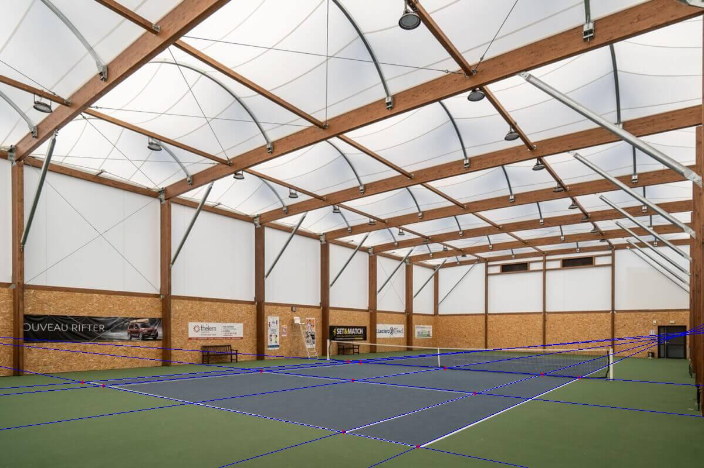 |
| ------------------------------------------------------------------------------ | ------------------------------------------------------------------------------ | ------------------------------------------------------------------------------ |
| 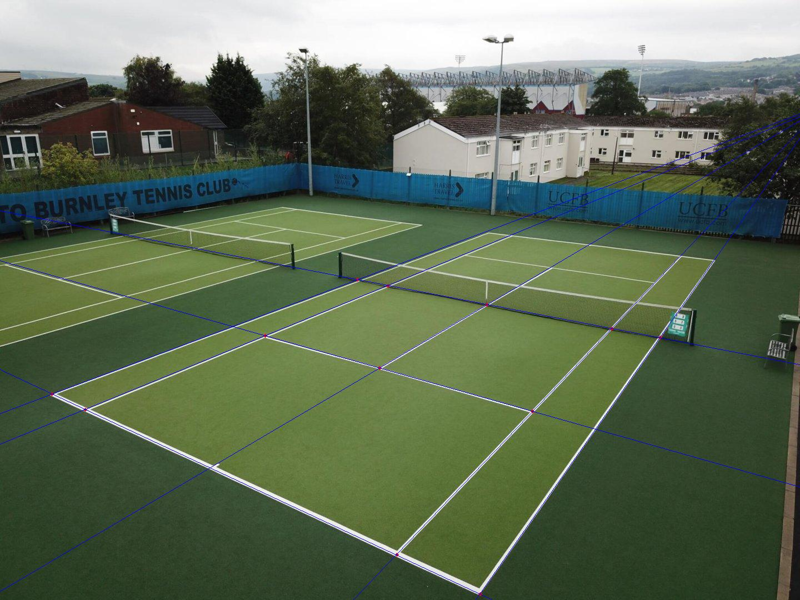 | 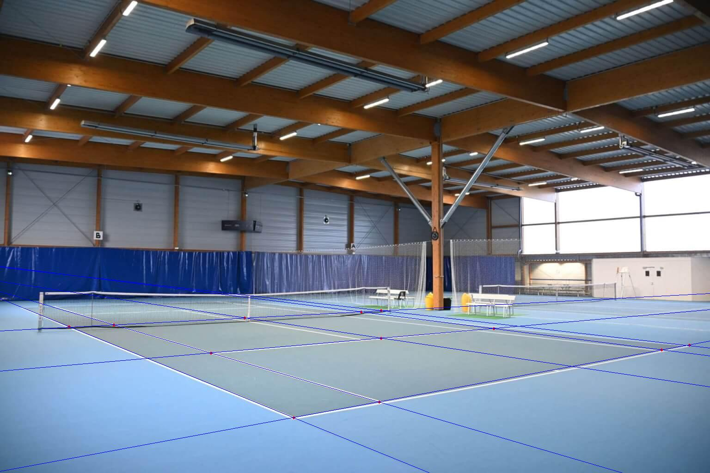 | 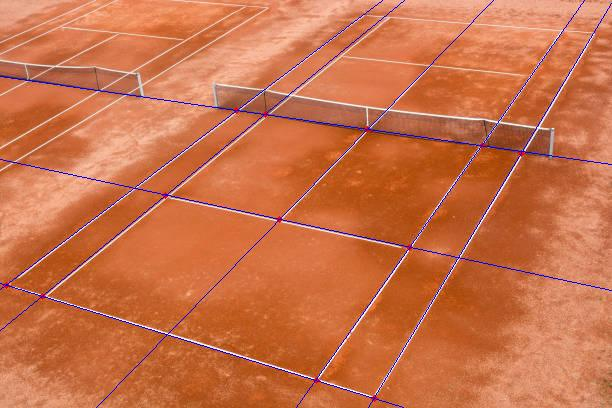 |


Each image was manually annotated using **Label Studio**, where all **12 key points** of the court were marked to form the **ground truth** dataset. 

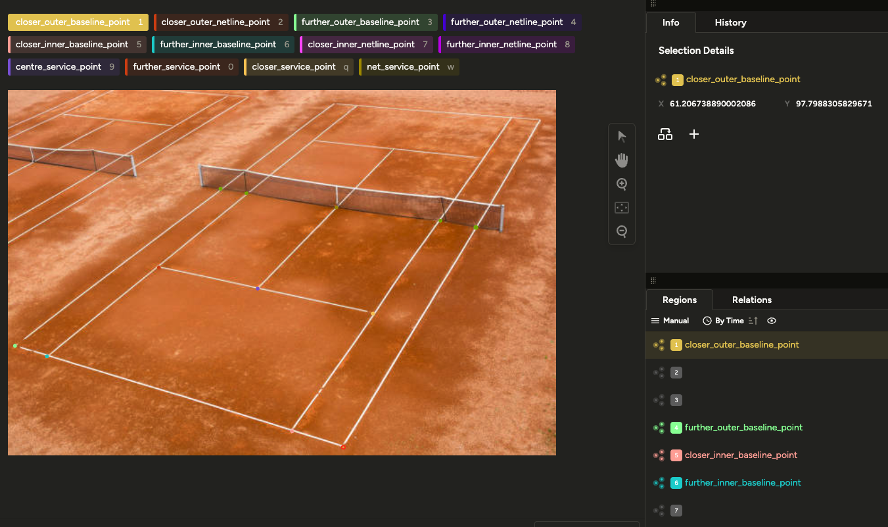

The coordinates of these manually labeled points were exported and stored in the file **`test.config.json`**.  
This configuration file allows a direct comparison between:
- the **points detected automatically** by the algorithm, and  
- their **corresponding ground truth** counterparts.

For each point, the **Euclidean distance** between the detected position and the true one is computed as:

$$
\text{error} = \sqrt{(x_{\text{pred}} - x_{\text{gt}})^2 + (y_{\text{pred}} - y_{\text{gt}})^2}
$$

This metric quantifies the **pixel-level deviation** of the detected key points.  
Lower values indicate higher geometric precision of the detection.

The evaluation results across the 6 test images are summarized as follows:

PLACEHOLDER -----

## Perspective Transformation

In the final stage of processing, the algorithm performs a **perspective transformation** that allows mapping between the **real tennis court geometry** and its **representation in the image**.

To achieve this, a **synthetic reference court** is first created — a perfectly scaled, flat representation of a tennis court with all key structural elements (outer and inner sidelines, baselines, service lines, and the net/center lines).  
Each of its characteristic points is defined in precise metric proportions, forming a **reference coordinate system** that serves as a geometric template for real images.

Once this reference model is built, the algorithm performs a **homography-based perspective warp** between:
- a selected subset of **corresponding points** (usually at least four) detected in the input image, and  
- the **reference points** from the synthetic court.

Using these pairs, the transformation matrix (homography) is estimated, enabling the algorithm to:
- **project all remaining reference points** into the image plane, and  
- **overlay the synthetic court** onto the detected court in the original image.

This process makes it possible to reconstruct the **entire geometry** of the court even when only a **minimum number of points** (typically four or more) are found directly by the detection algorithm — the rest are obtained automatically through projection.

The same procedure also allows for **quantitative error evaluation**:  
the projected points obtained through perspective transformation are compared against their **ground truth** positions, and their pixel-level deviations are measured under various scenarios.  
This makes it possible to verify whether using **homography-based projection** yields **lower positional errors** than detecting every point purely through classical algorithmic methods.

Overall, the perspective transformation step ensures full geometric consistency of the reconstructed tennis court and provides a powerful way to validate and refine the accuracy of the overall detection pipeline.

### Projection Error Summary

The quantitative evaluation of the **perspective transformation** was performed across multiple test configurations, each using a different subset of detected points for homography estimation.  
For every configuration, all remaining reference points were projected onto the image and compared with their ground truth locations.

Among all tested setups, the **best-performing scenario** — using four high-confidence corner points  
(`closer_outer_baseline_point`, `further_outer_baseline_point`, `closer_outer_netline_point`, and `further_outer_netline_point`) — achieved the following results:

PLACEHOLDER ---

These results confirm that under optimal conditions,  
the **homography-based perspective transformation** allows the algorithm to reconstruct  
the full set of key points with **subpixel-level consistency** in most cases,  
often achieving **lower positional error** than direct detection of all points through classical methods.


## Executing Tests

The project includes a dedicated testing pipeline located in **`scripts/test.py`**,  
which performs automatic evaluation of the algorithm on a predefined dataset.

The script should be executed as a **Python module**:

```bash
python -m scripts.test
```

The script accepts three optional arguments, all of which have default values aligned with the project’s internal directory structure:

| **Argument**      | **Default value**         | **Description**                                                                             |
| ----------------- | ------------------------- | ------------------------------------------------------------------------------------------- |
| `config_dir`      | `config/test.config.json` | Path to the configuration file containing ground truth point definitions and test metadata. |
| `pics_dir`        | `data/test`               | Directory containing input test images.                                                     |
| `results_df_name` | `"test_df"`               | Base name of the CSV file with computed test metrics.                                       |

```bash
python -m scripts.test --config_dir config/custom_config.json --pics_dir data/custom --results_df_name custom_run
```

### Output
After execution, the script produces:
  - annotated test images with detected and ground truth points saved in results/test/<run_name>, where <run_name> corresponds to the value specified in the config.test.json file
  - a CSV file containing per-point error values for each processed image

### Summary generation
To generate a statistical summary of all test runs, execute the summary script as a module:

```bash
python -m scripts.create_test_summary
```

This script:
  - aggregates all CSV results generated by previous test runs,
  - computes global error statistics (mean, median, and maximum errors),
  - and saves the final merged summary CSV in results/test with a timestamp appended to its filename

## Executing Run

Once the testing phase is complete, you can run the algorithm on your own images to evaluate real-case performance or visualize detections on new data.

#### Input setup

Example input images are provided in the **`data/run`** directory.  
Before running the algorithm, you may need to **adjust the input parameters** (thresholds, line detection sensitivity, etc.) to fit your image set.  
A recommended configuration template is available in: `config/run.config.json`


This file contains all the tunable parameters used during processing —  
you can modify their values to match lighting conditions, camera angles, or court surface types.

#### Running the algorithm

To execute the main pipeline, make sure your **virtual environment is activated**, then run:

```bash
python main.py
```

The script will automatically:
  - load all images from data/run,
  - apply the detection and reconstruction pipeline using the provided configuration,
  - and save all results — i.e., images with detected court lines and key points — to: `results/run/<timestamp>`


Each execution creates a new folder labeled with the timestamp of the run, ensuring that results from multiple executions are stored separately and never overwritten.

This mode is dedicated for experimenting with new photos, verifying algorithm robustness, and visually assessing detection accuracy on custom datasets.
