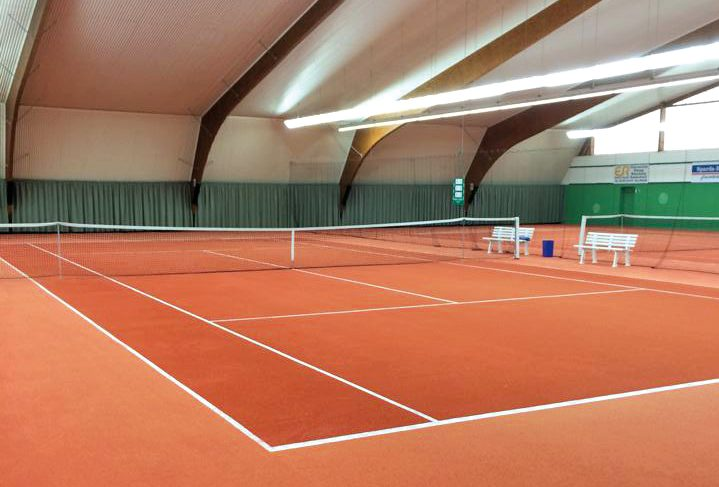
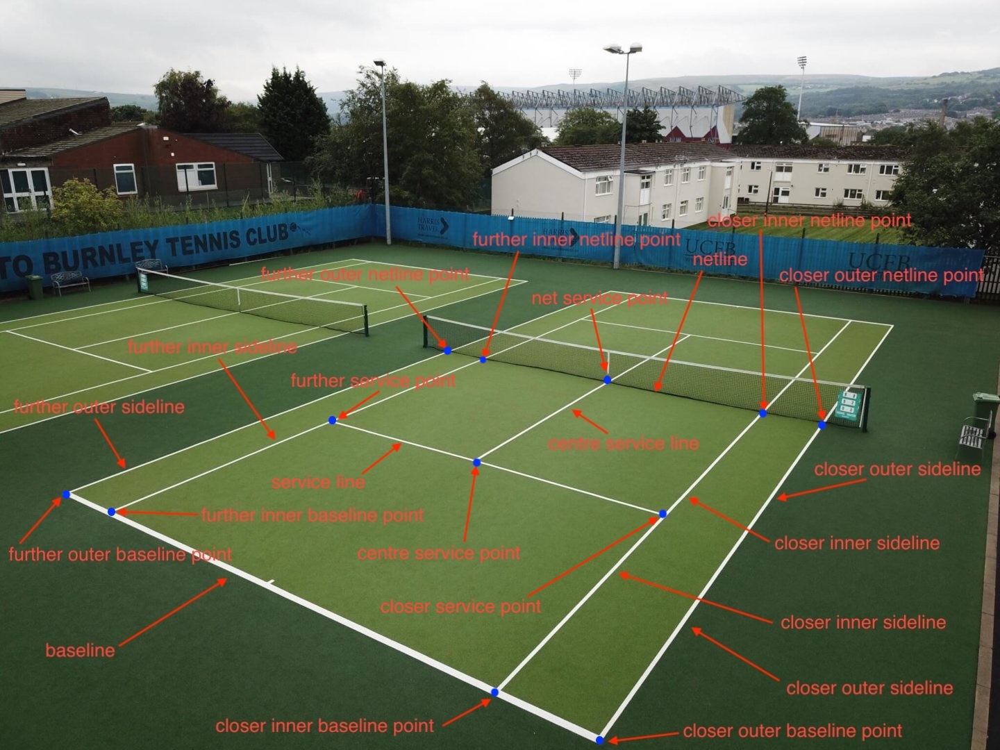

# CV Sport Geometry

**CV Sport Geometry** is a computer vision project that detects key points and geometric structures of **tennis courts** using **NumPy**, **classical computer vision algorithms and techniques**, and **mathematical concepts** such as **linear algebra** - no neural network applied.

The goal of this project is to accurately identify and extract the main lines, intersections, and reference points on a tennis court from images. Details and assumptions in the next chapter.

> **<span style="color:red">Note:</span>** This solution is **not intended for production use**.  
> It is an experimental project aimed at evaluating how classical image processing techniques perform in detecting key points of a tennis court.


Key libraries used:
<ul> 
    <li>numpy</li>
    <li>opencv-python</li>
    <li>matplotlib</li>
    <li>pydantic</li>
    <li>scikit-image</li>
    <li>label-studio</li>
</ul>

Key computer vision concepts included:
<ul> 
    <li>binarization and thresholding</li>
    <li>color channels</li>
    <li>the Probabilistic Hough Transform (PHT)</li>
    <li>perspective transformation</li>
    <li>skeletonization</li>
    <li>Canny Edge Detection</li>
    <li>morphological operations</li>
    <li>contour detection</li>
    <li></li>
</ul>


## Getting Started

Follow the steps below to set up and run the project locally.


### 1. Clone the Repository

Make sure you have **git** installed.  
Then clone the repository and navigate to the project directory:

```bash
git clone https://github.com/username/cv-sport-geometry.git
cd cv-sport-geometry
```

### 2. Requirements
You need to have <a href="https://docs.astral.sh/uv/getting-started/installation/">uv installed</a> on your system to manage the virtual environment and dependencies.
Once it’s installed, you can proceed with the setup.

### 3. Create and Activate the Virtual Environment
```bash
uv venv
source .venv/bin/activate  # Linux / macOS

.venv\Scripts\activate     # Windows
```

### 4. Sync Dependencies
Install all required dependencies using:
```bash
uv sync
```
This will install all packages defined in **pyproject.toml**.

### 5. Run the Project
Depending on how your entry point is defined, you can run the main script with:

```bash
uv run python main.py
```

## Project structure

## Project Assumptions

The project makes the following assumptions about the input images:

- The image must depict a **tennis court** where the **entire half of the court facing the camera** is clearly visible.  
- The **net** must be **visible** and **black in color**.  
- The photo should be taken **at a slight angle** relative to the court’s main axis, **not directly from the front**.

Below are examples of tennis courts that **meet** and **do not meet** the project assumptions. In the non-compliant image, the far corner of the baseline is not visible.

<div style="display: flex; justify-content: center; gap: 40px; text-align: center;">

  <div>
    <strong>compliant</strong><br>
    
  </div>

  <div>
    <strong>non-compliant</strong><br>
    
  </div>

</div>

## Objective

The goal is to develop an algorithm using **classical computer vision techniques** that detects **12 key points** on a tennis court and connects them with **straight line segments** to delineate the **playing field** and its **sub-areas**.  
Each point has been assigned a **unique, unambiguous identifier** to avoid any ambiguity during detection and post-processing.

The images below provide a complete description of all target elements.



