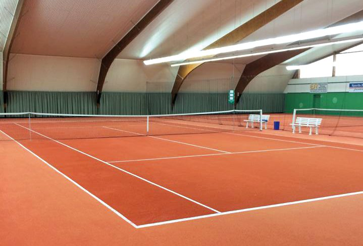
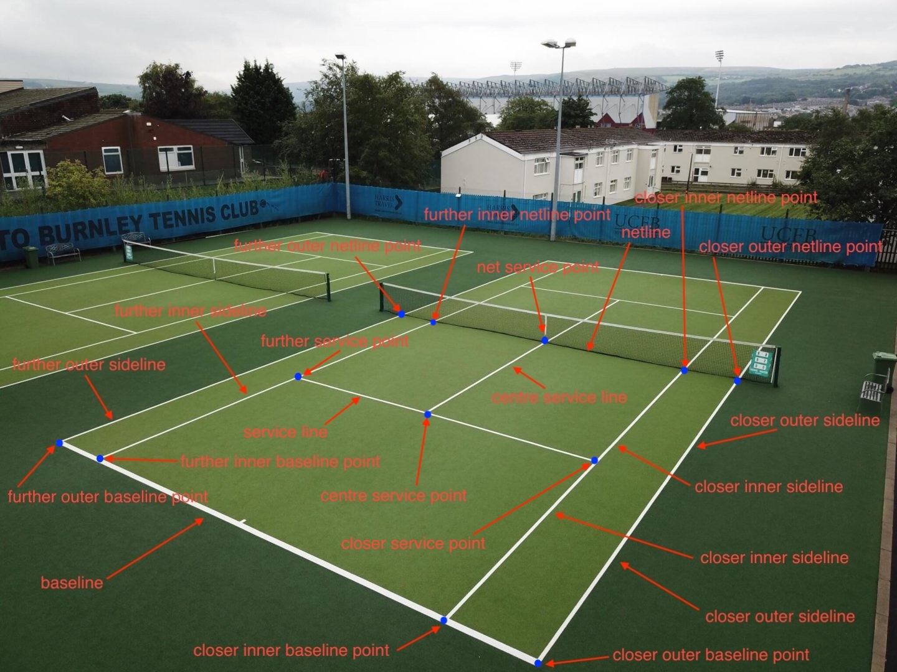

# CV Sport Geometry

**CV Sport Geometry** is a computer vision project that detects key points and geometric structures of **tennis courts** using **NumPy**, **classical computer vision algorithms and techniques**, and **mathematical concepts** such as **linear algebra** - no neural network applied.

The goal of this project is to accurately identify and extract the main lines, intersections, and reference points on a tennis court from images. Details and assumptions in the next chapter.

> ⚠️ **NOTE:** This solution is **not intended for production use**.  
> It is an experimental project aimed at evaluating how classical image processing techniques perform in detecting key points of a tennis court.


Key libraries used:
- numpy
- opencv-python
- matplotlib
- pydantic
- scikit-image
- label-studio

Key computer vision concepts included:
- color space analysis
- binarization and thresholding
- Canny Edge Detection
- the Probabilistic Hough Transform (PHT)
- morphological operations
- skeletonization
- contour detection
- perspective transformation


## Getting Started

Follow the steps below to set up and run the project locally.


### 1. Clone the Repository

Make sure you have **git** installed.  
Then clone the repository and navigate to the project directory:

```bash
git clone https://github.com/username/cv-sport-geometry.git
cd cv-sport-geometry
```

### 2. Requirements
You need to have <a href="https://docs.astral.sh/uv/getting-started/installation/">uv installed</a> on your system to manage the virtual environment and dependencies.
Once it’s installed, you can proceed with the setup.

### 3. Create and Activate the Virtual Environment
```bash
uv venv
source .venv/bin/activate  # Linux / macOS

.venv\Scripts\activate     # Windows
```

### 4. Sync Dependencies
Install all required dependencies using:
```bash
uv sync
```
This will install all packages defined in **pyproject.toml**.

### 5. Run the Project
Depending on how your entry point is defined, you can run the main script with:

```bash
uv run python main.py
```

## Project structure

## Project Assumptions

The project makes the following assumptions about the input images:

- The image must depict a **tennis court** where the **entire half of the court facing the camera** is clearly visible.  
- The **net** must be **visible** and **black in color**.  
- The photo should be taken **at a slight angle** relative to the court’s main axis, **not directly from the front**.

Below are examples of tennis courts that **meet** and **do not meet** the project assumptions. In the non-compliant image, the far corner of the baseline is not visible.

| **compliant** | **non-compliant** |
|----------------|------------------|
|  |  |

## Objective

The goal is to develop an algorithm using **classical computer vision techniques** that detects **12 key points** on a tennis court and connects them with **straight line segments** to delineate the **playing field** and its **sub-areas**.  
Each point has been assigned a **unique, unambiguous identifier** to avoid any ambiguity during detection and post-processing.

The images below provide a complete description of all target elements.



Key points with their names and explanations:
  1. `closer_outer_baseline_point` - the point closest to the camera, located at the intersection of the baseline and the outer doubles sideline.
It should be the lowest point on the court in the image
  2. `closer_outer_netline_point` - the intersection point of the tennis court’s nearer doubles sideline with the net
  3. `further_outer_baseline_point` - the opposite point to `closer_outer_baseline_point`, the intersection of the court’s far doubles sideline with the baseline
  4. `further_outer_netline_point` - the point opposite to `closer_outer_netline_point` - the intersection of the court’s far doubles sideline with the net line
  5. `closer_inner_baseline_point` - the intersection point of the court’s nearer singles sideline with the baseline
  6. `further_inner_baseline_point`- the intersection point of the court’s far singles sideline with the baseline
  7. `closer_inner_netline_point` - the intersection point of the court’s nearer singles sideline with the net line
  8. `further_inner_netline_point` - the intersection point of the court’s far singles sideline with the net line
  9. `net_service_point` - the intersection of the center service line with the net line
  10. `centre_service_point` - the intersection of the service line (parallel to the net) with the center service line
  11. `further_service_point` - the intersection of the court’s far singles sideline with the service line
  12. `closer_service_point` - the intersection of the court’s nearer singles sideline with the service line


By connecting the corresponding points, we obtain the following lines that define the playing field and its main areas:
  - `closer_outer_sideline` - the court’s nearer doubles sideline, it connects `closer_outer_baseline_point` with `closer_outer_netline_point`
  - `baseline` - connects `closer_outer_baseline_point` with `further_outer_baseline_point`
  - `netline` - the line representing the court’s net, it connects `closer_outer_netline_point` with `further_outer_netline_point`
  - `further_outer_sideline` - the court’s far doubles sideline, it connects `further_outer_baseline_point` with `further_outer_netline_point`
  - `closer_inner_sideline` - the court’s nearer singles sideline, it connects `closer_inner_baseline_point` with `closer_inner_netline_point` 
  - `further_inner_sideline` - the court’s far singles sideline, it connects `further_inner_baseline_point` with `further_inner_netline_point`
  - `centre_service_line` - the line representing the court’s center service line, it connects `centre_service_point` with `net_service_point` 
  - `service_line` - the line representing the court’s service line (parallel to the net), it connects `closer_service_point` with `further_service_point`


